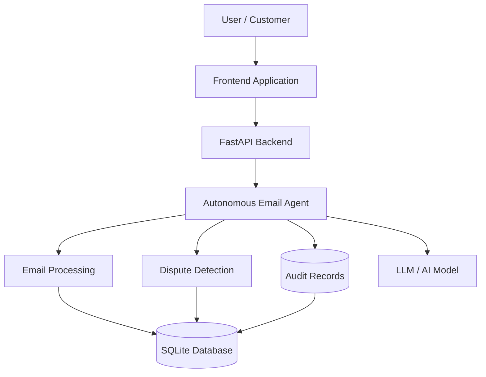
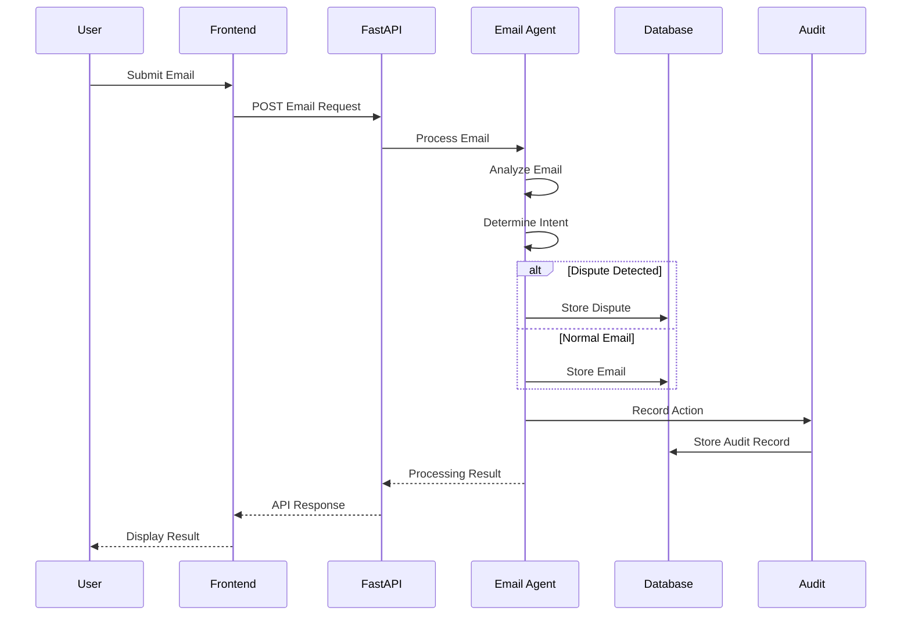
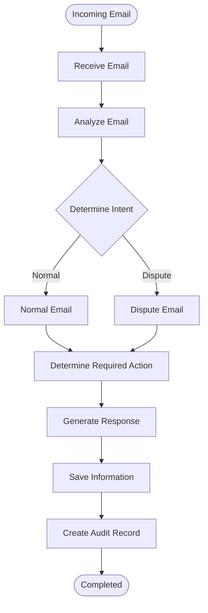
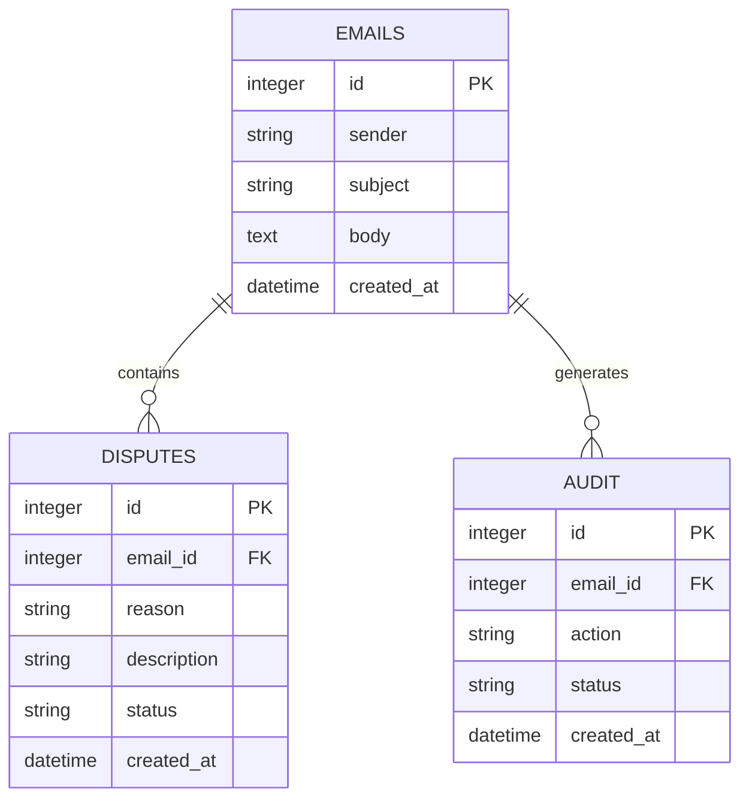
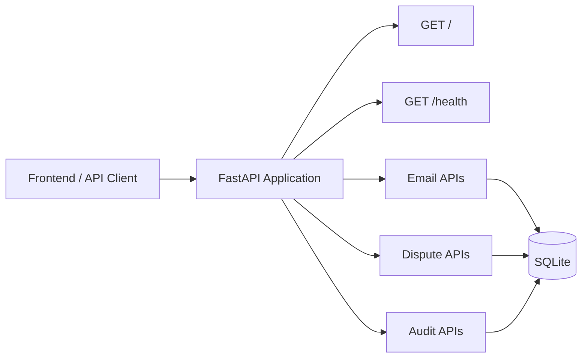
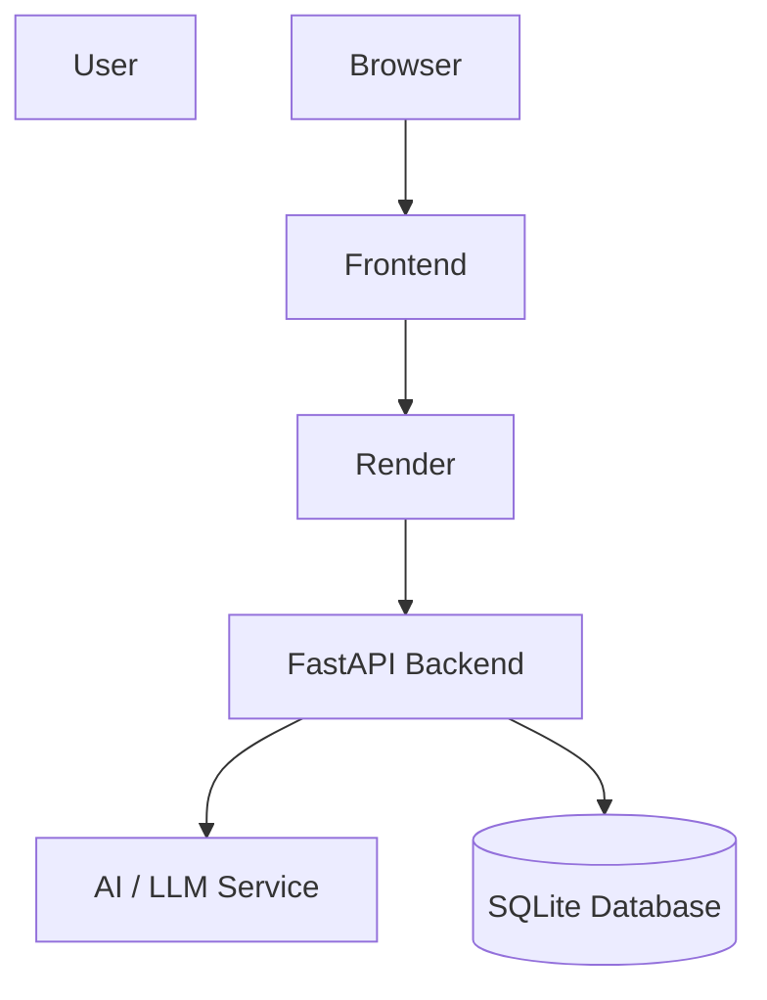
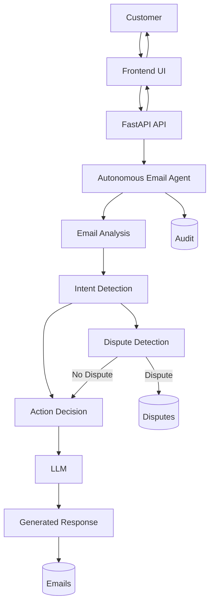

# Autonomous Email Agent — Architecture Diagrams

## 1. High-Level System Architecture

---

## 2. Email Processing Flow

---

## 3. Agent Workflow

---

## 4. Database Architecture

---

## 5. API Architecture

---

## 6. Deployment Architecture

---

## 7. Complete End-to-End Architecture

